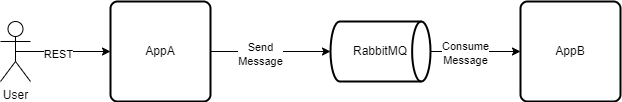

# General
This is a demo of asynchronous communication with RabbitMQ and Spring Cloud Stream.

## Description
The demo consists of 2 applications: AppA and AppB.

### AppA
The application receives arbitrary JSON input through a REST exposed endpoint (POST /input). The structure of the body can be any valid JSON object. 
The body is then send as a message to RabbitMQ destination/exchange (my-destination) using StreamBridge.

### AppB
The application registers 2 consumers of the messages send to 'my-destination'. As the consumers are registered within the same group, they are bound and consume messages from a single queue thus a message is only processed by a single consumer in a round-robin format.

## Running the demo
Run the docker-compose file first. This will run a dockerized RabbitMQ locally.
Run AppB first (to create the exchange/queue binding on RabbitMQ side).
Run AppA second. Send a post request to http://localhost:8080/input with any JSON input in the body.
Follow the logs to see how messages are consumed/processed.
